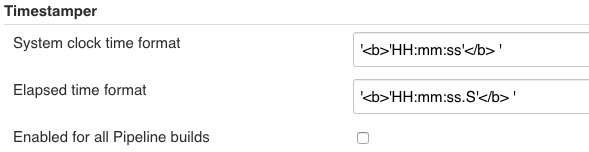

# Jenkins Timestamper Plugin

[](https://plugins.jenkins.io/timestamper)

The Timestamper Plugin adds timestamps to the Console Output of Jenkins jobs.

**Example output:**

```
21:51:15  Started by user anonymous
21:51:15  Building on master
21:51:17  Finished: SUCCESS
```

### Instructions: Freestyle

Enable timestamps within the "Build Environment" section of the build's configuration page.

To enable timestamps for multiple builds at once, use the [Configuration Slicing Plugin](https://wiki.jenkins.io/display/JENKINS/Configuration+Slicing+Plugin) version 1.32 or later.

### Instructions: [Pipeline Builds](https://wiki.jenkins-ci.org/display/JENKINS/Pipeline+Plugin)

**Since Timestamper 1.9**

Set the global option to enable timestamps for all Pipeline builds (in "Manage Jenkins" -> "Configure"), or use the step as described below.



**Since Timestamper 1.8**

Use the `timestamps` step to wrap the rest of the pipeline script.

```groovy
timestamps {
    // some block
}
```

**Since Timestamper 1.7**

Prior to Timestamper 1.8, timestamps can only be recorded within a node.

```groovy
node  {
    wrap([$class: 'TimestamperBuildWrapper']) {
        echo 'hello from Workflow'
    }
}
```

### Customization

-   The timestamp format can be configured via the `Configure System` page.
-   There is a panel on the left-hand side of the console page which allows either the system clock time or the elapsed time to be displayed.
-   The time zone used to display the timestamps can be configured by setting a system parameter as described here: [Change time zone](https://wiki.jenkins.io/display/JENKINS/Change+time+zone).

### Scripting

Scripts can read the timestamps from the `/timestamps/` URL of each build.

Examples:

-   `/timestamps/`\
    By default, display the elapsed time in seconds with three places after the decimal point.
-   `/timestamps/?time=HH:mm:ss&appendLog`\
    Display the system clock time and append the line from the log.
-   `/timestamps/?elapsed=HH:mm:ss.S&appendLog`\
    Display the elapsed time and append the line from the log.
-   `/timestamps/?time=HH:mm:ss&elapsed=HH:mm:ss.S`\
    Display both the system clock time and the elapsed time.
-   `/timestamps/?currentTime&time=HH:mm:ss`\
    Display the current time on the Jenkins master.

Supported query parameters:

-   **time** (since 1.8)\
    Display the system clock time. Accepts the [JDK SimpleDateFormat](http://docs.oracle.com/javase/6/docs/api/java/text/SimpleDateFormat.html) format.\
    The time zone and locale of the Jenkins server will be used, unless they are configured with the `timeZone` and `locale` query parameters.
-   **elapsed** (since 1.8)\
    Display the elapsed time since the start of the build. Accepts the [commons-lang DurationFormatUtils](https://commons.apache.org/proper/commons-lang/javadocs/api-2.6/org/apache/commons/lang/time/DurationFormatUtils.html) format.
-   **precision** (since 1.3.2)\
    Display the elapsed time in seconds, with a certain number of places after the decimal point. Accepts a number of decimal places or values such as `seconds` and `milliseconds`.
-   **appendLog** (since 1.8)\
    Display the console log line after the timestamp.
-   **startLine** (since 1.8)\
    Display the timestamps starting from a certain line. Accepts a positive integer to start at that line, or a negative integer to start that many lines back from the end.
-   **endLine** (since 1.8)\
    Display the timestamps ending at a certain line. Accepts a positive integer to finish at that line, or a negative integer to finish that many lines back from the end.
-   **timeZone** (since 1.8)\
    Time zone used when displaying the system clock time. Accepts the [JDK TimeZone](http://docs.oracle.com/javase/6/docs/api/java/util/TimeZone.html) ID format.
-   **locale** (since 1.8)\
    Select the locale to use when displaying the system clock time. Accepts a locale in the format recognised by [commons-lang LocaleUtils.toLocale](https://commons.apache.org/proper/commons-lang/javadocs/api-2.6/org/apache/commons/lang/LocaleUtils.html#toLocale(java.lang.String)).
-   **currentTime** (since 1.8.8)\
    Display the current time on the Jenkins master instead of reading timestamps from the build.

Reading the timestamps directly from the file system is not recommended, because the format may change.

### Java API

**Since Timestamper 1.8**

Other plugins can add a [dependency](https://wiki.jenkins-ci.org/display/JENKINS/Dependencies+among+plugins) on the Timestamper plugin, and then use the `TimestamperAPI.read` method to retrieve the timestamps.\
The `read` method accepts any query string that can be passed to the `/timestamps/` URL.

```java
String query = "time=HH:mm:ss";
try (BufferedReader reader = TimestamperAPI.get().read(build, query)) {
    // read timestamps here
}
```
---
For release notes, please see [CHANGELOG.md](CHANGELOG.md) and the [GitHub release page](https://github.com/jenkinsci/timestamper-plugin/releases).
